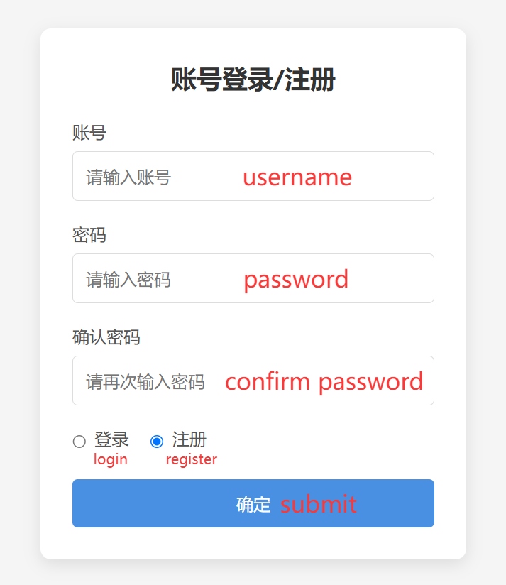
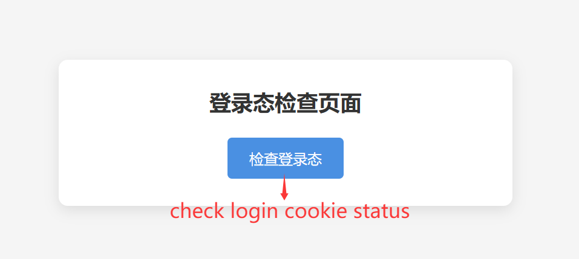
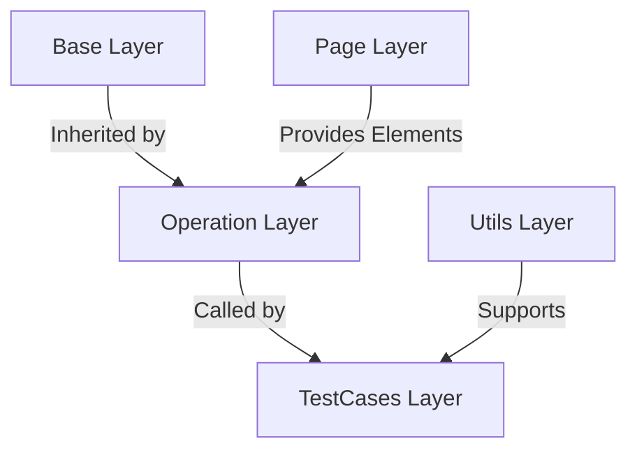

## Project Introduction

This project is an open-source demo of a WebUI automation testing framework based on **Java** and the **Page Object (PO) Model**, featuring:

✅ **Proven in Practice**: Frameworks using this encapsulation approach have been validated in medium-to-large projects at two companies.  
✅ **Strong Compatibility**: <span style="background:#ffeb3b;padding:2px 5px;border-radius:3px">Written based on JDK8, minimum compatibility JDK8</span>  
✅ **Standardized Comments**: All classes and methods include bilingual (Chinese-English) comments following javadoc specifications.  
✅ **Open Source License**: Licensed under GNU Affero GPL v3.0 and additional terms ([View Details](LICENSE))

### Comment Example


## Project Structure

```bash
selenium-po/
├── .idea/                      # IDEA configuration files
├── .mvn/                       # Maven Wrapper files
├── docs/                       # Documentation resources
│   └── image/                  # Image resources for README
├── src/                        # Source code
│   ├── main/                   # Main source directory
│   └── test/                   # Test code directory
│       ├── java/               # Java test code
│       │   └── com/stephen/    # Core package path
│       │       ├── base/       # Base operation encapsulations
│       │       │   └── BaseAction.java
│       │       ├── operation/  # Page operation classes
│       │       │   ├── CookieCheckPageOperation.java
│       │       │   └── LoginPageOperation.java
│       │       ├── page/       # Page element classes
│       │       │   ├── CookieCheckPage.java
│       │       │   └── LoginPage.java
│       │       ├── testcases/  # Test cases
│       │       │   ├── TestCookieCheck.java
│       │       │   └── TestLogin.java
│       │       └── utils/      # Utility classes
│       │           ├── DriverUtils.java
│       │           └── GetTestData.java
│       └── resources/          # Test resources
│           ├── logback-test.xml    # Log configuration
│           └── TestData.xls        # Test data
│           └── web-test-demo.jar   # Web test Demo
├── LICENSE         # License file
├── NOTICE          # Notice file
├── pom.xml         # Maven configuration
└── testng.xml      # TestNG configuration
```

## 

## 📜 License Description

> ⚠️ **Important Legal Notice**  
> This project is governed by the **GNU Affero General Public License v3.0** and additional terms:
> 
> - ✅ **Permitted**
>   
>   - Individuals/enterprises can freely download and modify the code.
>   
>   - Modified code can be deployed to production environments.
>   
>   - Can be used for internal enterprise training.
> 
> - ❌ **Prohibited**
>   
>   - Packaging into courses for commercial training and sale.
> 
> - 💡 **Recommended**
>   
>   - Share modifications and improvements openly **via open source**.
> 
> 📄 **Complete terms** **are detailed in the** [LICENSE file](LICENSE)

## 

## Preface

### 1. Development Purpose

***This is a Web UI automation testing framework demo based on Java + Page Object Model encapsulation.*** It primarily addresses the framework encapsulation challenges for automation engineers transitioning from Python to Java. It aims to provide a systematic encapsulation tutorial, solving technology selection and implementation difficulties.

### 2. Technology Stack Comparison

| Purpose                   | Python          | Java             |
| ------------------------- | --------------- | ---------------- |
| **Dependency Mgmt**       | pip             | Maven            |
| **Web Test Framework**    | Selenium        | Selenium-Java    |
| **Unit Test Framework**   | pytest          | TestNG           |
| **Excel Data Processing** | openpyxl        | Apache.poi       |
| **Logging Framework**     | logging         | logback          |
| **Browser Driver Mgmt**   | Manual Download | WebDriverManager |

## 🚀 Quick Start Guide

### Web Demo Description

The project includes a locally deployable web demo (~2MB), containing two simple pages:

1. **Registration/Login Page**  
   
   
   
   Access URL: `http://127.0.0.1:8080/login`

2. **Login Status Check Page**  
   
   Access URL: `http://127.0.0.1:8080/cookie_check`

> 📍 **Demo Location**: `src/test/resources/web-test-demo.jar`  
> 
> 

#### Features:

- ✅ **One-click Deployment**: Run with `java -jar` (No Tomcat/Database needed)

- ⚠️ **Temporary Data**: Data is cleared on each run (requires re-registration)

### Deployment Steps

1. **Start Web Demo**

```bash
# Navigate to the jar directory
cd src/test/resources/
# Start the service
java -jar web-test-demo.jar
```

2) **Run Tests**

```bash
# Execute in the project root directory
mvn test
```

> **Note**: The first run will automatically download the Chrome driver. It will re-download if the browser is updated.

## 

#### 🧱 Framework Encapsulation Analysis

### **PO Model Layered Architecture**



### 1. Core Components

#### **base package** (Base Layer)

Encapsulates common Selenium APIs, optimized with explicit waits for element location:

```java
 public WebElement findEle(By by) {
        WebDriverWait wait = new WebDriverWait(driver, Duration.ofSeconds(10));
        return wait.until(ExpectedConditions.presenceOfElementLocated(by));
 }
```

#### **page package** (Object Layer)

Encapsulates elements by page, using static constants:

```java
/**
 * 注册单选按钮 / Register radio button
 * <p>
 * CSS选择器: #registerRadio<br>
 * CSS selector: #registerRadio
 * </p>
 */
public static final By REGISTER_RADIO_BUTTON = By.cssSelector("#registerRadio");
```

#### **operation package** (Operation Layer)

Inherits the BaseAction class, encapsulating page operations:

```java
/**
 * 点击注册单选按钮 / Clicks register radio button
 * <p>
 * 调用父类Click()方法点击注册单选按钮。<br>
 * Invokes parent click() method to click register radio button.
 * </p>
 */
public void clickRegisterRadioButton() {
    super.click(LoginPage.REGISTER_RADIO_BUTTON);
}
```

#### **utils package** (Utils Layer)

Encapsulates browser management and test data reading:

```java
/**
 * 打开浏览器 / Opens browser
 *
 * <p>
 * 首次启动或检测到浏览器版本更新后与驱动版本不匹配：自动下载或更新与浏览器版本匹配的浏览器驱动<br>
 * Automatically downloads/updates browser driver matching browser version when:
 * 1. First launch, or
 * 2. Browser version update causes driver version mismatch
 * </p>
 *
 * @return WebDriver 浏览器实例对象 / WebDriver instance
 */
public static WebDriver getDriver() {
    //设置环境变量指定Chrome浏览器驱动的中国地区镜像下载地址（中国地区以外的开发者请去掉System.setProperty()方法的调用，避免下载速度过慢）
    //Sets environment variable for Chrome driver mirror in China region (Non-China developers should remove this to avoid slow downloads)
    System.setProperty("wdm.driverManagerUrl",
            "https://registry.npmmirror.com/binary.html?path=chrome-for-testing/");

    //获取浏览器对象并使浏览器窗口最大化
    //Acquires WebDriver instance and maximizes browser window
    WebDriverManager.chromedriver().setup();
    WebDriver driver = new ChromeDriver();
    driver.manage().window().maximize();
    return driver;
}
```

#### **testcases package** (Business Layer)

Uses TestNG DataProvider for parameterized tests:

```java
@Test(groups = "Login", priority = 1,dataProvider = "RegisterData", dataProviderClass = GetTestData.class)
public void testRegister(String username, String password, String confirmPassword, String expectedResult) {
    // Test flow
}
```

### 2. Design Basis

Based on the [Selenium Official Design Patterns](https://www.selenium.dev/documentation/test_practices/encouraged/page_object_models/):

> "For complex pages, it is recommended to separate element location from behavior."

## 🛠️ Auxiliary File Description

| File               | Purpose                      |
| ------------------ | ---------------------------- |
| `pom.xml`          | Maven Dependency Management  |
| `testng.xml`       | TestNG Test Configuration    |
| `logback-test.xml` | Logging System Configuration |
