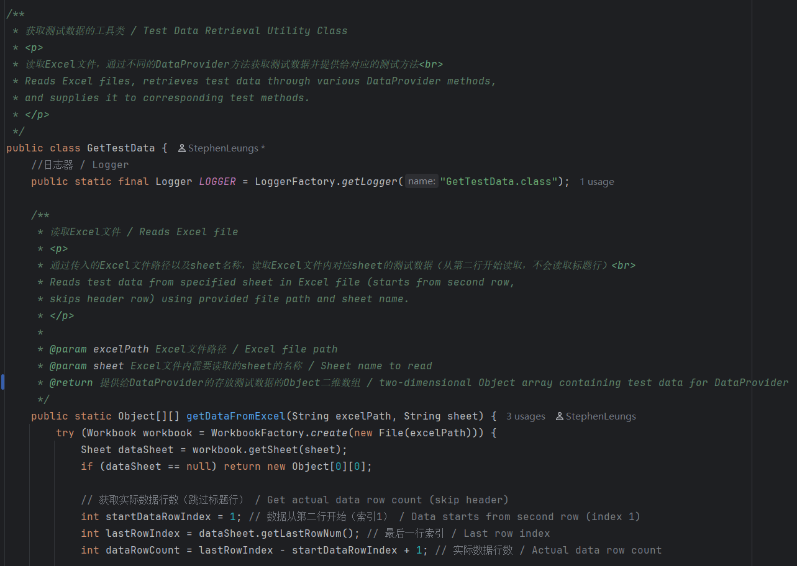
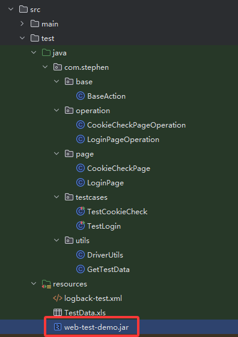

# ***中文版README指南（English README available below）***

[English README Documentation](README.en.md)

---

## 项目简介

本项目是一个开源的基于 **Java** 和 **PO模型** 封装的WebUI自动化测试框架Demo，具有以下特点：

✅ **实战验证**：参照此封装方式的框架已通过两家公司中大型项目验证  
✅ **兼容性强**：<span style="background:#ffeb3b;padding:2px 5px;border-radius:3px">基于JDK8编写，最低兼容JDK8</span>  
✅ **规范注释**：所有类和方法均参考javadoc规范，添加中英双语注释  
✅ **开源协议**：遵循GNU Affero GPL v3.0及附加条款([查看详情](LICENSE))

### 注释示例



## 项目结构

```bash
selenium-po/
├── .idea/                      # IDEA 配置文件
├── .mvn/                       # Maven 包装器文件
├── docs/                       # 文档资源
│   └── image/                  # README引用的图片资源
├── src/                        # 源代码
│   ├── main/                   # 主代码目录
│   └── test/                   # 测试代码目录
│       ├── java/               # Java测试代码
│       │   └── com/stephen/    # 核心包路径
│       │       ├── base/       # 基础操作封装
│       │       │   └── BaseAction.java
│       │       ├── operation/  # 页面操作类
│       │       │   ├── CookieCheckPageOperation.java
│       │       │   └── LoginPageOperation.java
│       │       ├── page/       # 页面元素类
│       │       │   ├── CookieCheckPage.java
│       │       │   └── LoginPage.java
│       │       ├── testcases/  # 测试用例
│       │       │   ├── TestCookieCheck.java
│       │       │   └── TestLogin.java
│       │       └── utils/      # 工具类
│       │           ├── DriverUtils.java
│       │           └── GetTestData.java
│       └── resources/          # 测试资源
│           ├── logback-test.xml    # 日志配置
│           └── TestData.xls        # 测试数据
│           └── web-test-demo.jar   # Web测试Demo
├── LICENSE         # 许可证文件
├── NOTICE          # 声明文件
├── pom.xml         # Maven配置
└── testng.xml      # TestNG配置
```

## 📜 许可证说明

> ⚠️ **重要法律声明**  
> 本项目受 **GNU Affero General Public License v3.0** 及附加条款约束：
> 
> - ✅ **允许**
>   
>   - 个人/企业自由下载、修改代码
>   
>   - 修改后部署到企业生产环境
>   
>   - 企业内部培训使用
> 
> - ❌ **禁止**
>   
>   - 包装成课程进行商业培训及售卖
> 
> - 💡 **建议**
>   
>   - 修改完善后的代码尽量开源分享
> 
> 📄 完整条款详见 [LICENSE 文件](LICENSE)

## 前言

### 1. 开发初衷

***这是一个基于Java+PO模型封装的Web UI自动化测试框架Demo***，主要解决自动化测试工程师从Python转Java时的框架封装问题。旨在提供系统性封装教程，解决技术选型和封装实现难题。

### 2. 技术栈对比

| 作用            | Python   | Java             |
| ------------- | -------- | ---------------- |
| **依赖管理**      | pip      | Maven            |
| **Web测试框架**   | Selenium | Selenium-Java    |
| **单元测试框架**    | pytest   | TestNG           |
| **Excel数据处理** | openpyxl | Apache.poi       |
| **日志框架**      | logging  | logback          |
| **浏览器驱动管理**   | 手动下载     | WebDriverManager |

## 🚀 快速启动指南

### 调试网页说明

项目包含本地可部署的网页Demo（约2MB），包含两个简单页面：

1. **注册登录页**  
   
   
   
   访问地址：`http://127.0.0.1:8080/login`

2. **登录态检查页**  
   
   访问地址：`http://127.0.0.1:8080/cookie_check`

> 📍 **Demo位置**：`src/test/resources/web-test-demo.jar`  
> 

#### 特点：

- ✅ **一键部署**：`java -jar` 即可运行（无需Tomcat/数据库）

- ⚠️ **数据临时性**：每次运行清空上次数据（需重新注册）

### 部署步骤

1. **启动Web Demo**
   
   ```bash
   # 进入jar包目录
   cd src/test/resources/
   
   # 启动服务
   java -jar web-test-demo.jar
   ```
2) **运行测试**
   
   ```bash
   # 在项目根目录执行
   mvn test
   ```

> **注意**：首次运行会自动下载Chrome驱动，浏览器更新后会重新下载

## 🧱 框架封装解析

### **PO模型分层架构**

graph TD
    A[Base层] -->|被继承| B[Operation层]
    C[Page层] -->|提供元素| B
    B -->|调用| D[TestCases层]
    E[Utils层] -->|支持| D

### 1. 核心组件

#### **base包**（基础层）

封装Selenium常用API，使用显式等待优化元素定位：

```java
 public WebElement findEle(By by) {
        WebDriverWait wait = new WebDriverWait(driver, Duration.ofSeconds(10));
        return wait.until(ExpectedConditions.presenceOfElementLocated(by));
 }
```

#### **page包**（对象层）

按页面封装元素，使用静态常量：

```java
/**
 * 注册单选按钮 / Register radio button
 * <p>
 * CSS选择器: #registerRadio<br>
 * CSS selector: #registerRadio
 * </p>
 */
public static final By REGISTER_RADIO_BUTTON = By.cssSelector("#registerRadio");
```

#### **operation包**（操作层）

继承BaseAction类，封装页面操作：

```java
/**
 * 点击注册单选按钮 / Clicks register radio button
 * <p>
 * 调用父类Click()方法点击注册单选按钮。<br>
 * Invokes parent click() method to click register radio button.
 * </p>
 */
public void clickRegisterRadioButton() {
    super.click(LoginPage.REGISTER_RADIO_BUTTON);
}
```

#### **utils包**（工具层）

封装浏览器管理和测试数据读取：

```java
/**
 * 打开浏览器 / Opens browser
 *
 * <p>
 * 首次启动或检测到浏览器版本更新后与驱动版本不匹配：自动下载或更新与浏览器版本匹配的浏览器驱动<br>
 * Automatically downloads/updates browser driver matching browser version when:
 * 1. First launch, or
 * 2. Browser version update causes driver version mismatch
 * </p>
 *
 * @return WebDriver 浏览器实例对象 / Browser instance object
 */
public static WebDriver getDriver() {
    //设置环境变量指定Chrome浏览器驱动的中国地区镜像下载地址（中国地区以外的开发者请去掉System.setProperty()方法的调用，避免下载速度过慢）
    //Sets environment variable for Chrome driver mirror in China region (Non-China developers should remove this to avoid slow downloads)
    System.setProperty("wdm.driverManagerUrl",
            "https://registry.npmmirror.com/binary.html?path=chrome-for-testing/");

    //获取浏览器对象并使浏览器窗口最大化
    //Acquires browser instance and maximizes browser window
    WebDriverManager.chromedriver().setup();
    WebDriver driver = new ChromeDriver();
    driver.manage().window().maximize();
    return driver;
}
```

#### **testcases包**（业务层）

使用TestNG DataProvider参数化测试：

```java
@Test(groups = "Login", priority = 1,dataProvider = "RegisterData", dataProviderClass = GetTestData.class)
public void testRegister(String username, String password, String confirmPassword, String expectedResult) {
    // 测试逻辑
}
```

### 2. 设计依据

根据[Selenium官方设计模式](https://www.selenium.dev/documentation/test_practices/encouraged/page_object_models/)：

> "对于复杂页面，建议将元素定位与行为分离"

## 

## 🛠️ 辅助文件说明

| 文件                 | 作用         |
| ------------------ | ---------- |
| `pom.xml`          | Maven依赖管理  |
| `testng.xml`       | TestNG测试配置 |
| `logback-test.xml` | 日志系统配置     |